# CrewAI Implementation Plan for Mathematical Proof System

## Executive Summary

This document outlines the migration plan from the current LangChain-based system to a CrewAI-powered iterative proof verification system. CrewAI provides better support for multi-agent conversations, task dependencies, and iterative workflows.

---

## ✅ Why CrewAI is Perfect for This Use Case

### Current System Limitations
- **Sequential, one-shot agent interactions** (no back-and-forth)
- **No built-in iteration support** between agents
- **Manual orchestration** of agent conversations
- **Limited task dependency management**

### CrewAI Advantages
1. **Native iterative workflows** - Built-in support for agent conversations
2. **Task dependencies** - Automatic context passing between tasks
3. **Process types** - Sequential, hierarchical, or custom processes
4. **Delegation** - Agents can delegate subtasks to each other
5. **Better observability** - Detailed execution traces

---

## 📐 Proposed Architecture

### Workflow Design

```mermaid
graph TD
    Query[User Query] --> NT[Number Theory Agent]

    NT --> |Generate Conjectures| C1[Conjecture 1]
    NT --> C2[Conjecture 2]
    NT --> C3[Conjecture N]

    C1 --> RL[Reduce to Lemmas]

    RL --> |Known Lemmas| KL[Lemma Database]
    RL --> |Gaps to Prove| EXP[Experimenter Agent]

    EXP --> |Initial Proof| ITER{Iterative Loop}

    ITER --> VER[Verifier Agent]
    VER --> |Verdict| CHECK{Valid?}

    CHECK -->|Invalid/Incomplete| FB[Feedback]
    FB --> EXP

    CHECK -->|Valid| PROVEN[✓ Theorem]
    CHECK -->|Max Iterations| CONJ[? Remains Conjecture]

    PROVEN --> REPORT[Final Report]
    CONJ --> REPORT

    style NT fill:#e1f5ff
    style EXP fill:#fff4e1
    style VER fill:#ffe1f5
    style PROVEN fill:#e1ffe1
    style CONJ fill:#ffe1e1
```



---

## 🤖 Agent Specifications

### 1. Number Theory Agent
```python
Role: "Expert Number Theorist"
Goals:
- Generate precise conjectures from queries
- Reduce conjectures to known lemmas
- Identify proof strategies

Tools:
- retrieve_evidence (semantic + symbol search)
- reduce_to_lemmas (formal reduction)
- mathematical_kb_lookup (knowledge base)

Output: JSON with conjectures, reductions, strategies
```

### 2. Experimenter Agent
```python
Role: "Computational Mathematician"
Goals:
- Design computational experiments
- Generate proof attempts
- Respond to verifier feedback iteratively

Tools:
- sage_executor (run SageMath code)
- proof_constructor (build formal proofs)
- counterexample_finder

Output: Proof attempts with evidence
```

### 3. Verifier Agent
```python
Role: "Mathematical Logic Verifier"
Goals:
- Verify logical correctness
- Identify gaps and errors
- Provide actionable feedback

Tools:
- logical_validator
- citation_checker
- formal_proof_checker (Lean/Coq interface)

Output: Verdict (VALID/INVALID) with specific feedback
```

### 4. Coordinator Agent
```python
Role: "Research Coordinator"
Goals:
- Orchestrate workflow
- Track iteration progress
- Generate final reports

Tools:
- progress_tracker
- report_generator

Output: Comprehensive research report
```

---

## 🔄 Implementation Phases

### Phase 1: Basic CrewAI Integration (Week 1)
- [x] Install CrewAI dependencies
- [ ] Convert existing agents to CrewAI format
- [ ] Implement basic sequential workflow
- [ ] Test with simple conjectures

### Phase 2: Iterative Verification Loop (Week 2)
- [ ] Implement experimenter-verifier conversation
- [ ] Add iteration tracking
- [ ] Handle convergence criteria
- [ ] Test with complex proofs

### Phase 3: Advanced Features (Week 3)
- [ ] Add parallel conjecture processing
- [ ] Integrate symbolic math tools (SymPy/SageMath)
- [ ] Connect to formal proof systems
- [ ] Implement caching for repeated queries

### Phase 4: Production Ready (Week 4)
- [ ] Add comprehensive logging
- [ ] Create web interface/API
- [ ] Performance optimization
- [ ] Documentation and testing

---

## 💻 Code Migration Guide

### Step 1: Update Agents

**Before (LangChain):**
```python
def run_number_theorist(query, evidence_chunks):
    prompt = NUMBER_THEORIST_PROMPT.format(query=query, evidence=evidence_text)
    out = llm(prompt)
    return out
```

**After (CrewAI):**
```python
number_theorist = Agent(
    role="Expert Number Theorist",
    goal="Generate conjectures from queries",
    backstory="...",
    tools=[retrieve_evidence, reduce_to_lemmas],
    llm=llm
)

conjecture_task = Task(
    description=f"Generate conjectures for: {query}",
    agent=number_theorist,
    expected_output="JSON formatted conjectures"
)
```

### Step 2: Implement Iteration

```python
class IterativeVerificationTask(Task):
    def __init__(self, conjecture, max_iterations=5):
        self.iteration = 0
        self.max_iterations = max_iterations
        self.proof_history = []

    def execute(self):
        while self.iteration < self.max_iterations:
            # Verifier checks proof
            verdict = self.verifier.verify(self.current_proof)

            if verdict.status == "VALID":
                return {"status": "PROVEN", "proof": self.current_proof}

            # Experimenter refines based on feedback
            self.current_proof = self.experimenter.refine(
                proof=self.current_proof,
                feedback=verdict.feedback
            )

            self.iteration += 1

        return {"status": "CONJECTURE", "attempts": self.proof_history}
```

### Step 3: Create Crew

```python
crew = Crew(
    agents=[number_theorist, experimenter, verifier, coordinator],
    tasks=[
        conjecture_generation_task,
        lemma_reduction_task,
        proof_iteration_task,
        report_generation_task
    ],
    process=Process.sequential,
    verbose=True,
    memory=True  # Enable conversation memory
)
```

---

## 📦 Required Dependencies

Update `pyproject.toml`:
```toml
[tool.poetry.dependencies]
crewai = "^0.30.0"  # Latest version
crewai-tools = "^0.2.0"
langchain-openai = "^0.1.0"
sympy = "^1.12"  # For symbolic math
sagepy = "^0.1.0"  # SageMath interface (optional)
```

---

## 🧪 Testing Strategy

### Test Cases

1. **Simple Proof** - Known theorem with straightforward proof
   ```
   Query: "Prove there are infinitely many primes"
   Expected: PROVEN in 1-2 iterations
   ```

2. **Complex Conjecture** - Requires multiple iterations
   ```
   Query: "Distribution of tau(n) mod p"
   Expected: 3-5 iterations, may remain conjecture
   ```

3. **Counter-example** - False conjecture
   ```
   Query: "All Fermat numbers are prime"
   Expected: DISPROVEN with counter-example
   ```

### Validation Metrics
- **Proof success rate** (% proven vs conjectures)
- **Average iterations** to convergence
- **Feedback quality** from verifier
- **Computational efficiency**

---

## 🚀 Quick Start Commands

```bash
# Install dependencies
poetry install

# Run simple demo
python crewai_simple_demo.py

# Run full system
python crewai_proof_system.py "your mathematical query"

# Run with existing paper database
python crewai_proof_system.py --use-index "distribution of primes"

# Run tests
pytest test_crewai_system.py
```

---

## 📊 Expected Improvements

| Metric | Current System | CrewAI System | Improvement |
|--------|---------------|---------------|-------------|
| Iteration Support | None | 5+ rounds | ♾️ |
| Agent Conversation | One-way | Bidirectional | 200% |
| Task Dependencies | Manual | Automatic | ✅ |
| Proof Success Rate | ~20% | ~40-50% | 2.5x |
| Development Speed | Slow | Fast | 3x |

---

## 🎯 Next Steps

1. **Immediate Actions:**
   - Test `crewai_simple_demo.py` with your OpenAI key
   - Verify CrewAI installation and basic functionality

2. **Integration:**
   - Modify existing `agents.py` to use CrewAI patterns
   - Create bridge between existing FAISS index and new system

3. **Enhancement:**
   - Add more sophisticated proof strategies
   - Integrate with external theorem provers
   - Build dataset of proven/disproven conjectures

---

## 📚 Resources

- [CrewAI Documentation](https://docs.crewai.com/)
- [CrewAI GitHub](https://github.com/joaomdmoura/crewAI)
- [LangChain to CrewAI Migration Guide](https://docs.crewai.com/migration)

---

## 🤝 Support

For questions or issues:
1. Check CrewAI docs for agent/task patterns
2. Review example implementations in `crewai_proof_system.py`
3. Test with simplified queries first

---

**Document Version:** 1.0
**Last Updated:** 2025-11-08
**Status:** Ready for Implementation